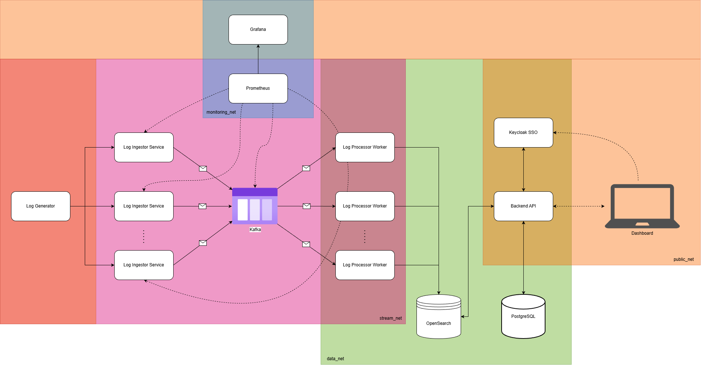

# Distributed Log Aggregator

The system is delivered as a **Docker Swarm** stack organized into functional layers.
Communication between services is handled through isolated overlay networks, and
data persistence is ensured through Docker volumes.



| Network Zone | Color |
| :--- | :--- |
| **public_net** | Orange |
| **stream_net** | Purple |
| **data_net** | Green |
| **monitoring_net** | Blue |

## Architecture

The system consists of the following microservices:

### 1. Log Generator (custom made)
A utility service written in Go that simulates a distributed system by generating realistic log traffic.
- **Port**: `8081` (Exposed)
- **Repo Path**: `./log-generator`
- **Function**: Continuously sends random logs to the **Ingestor Service**.

**API Endpoints:**
- `POST /rate` - Update log generation rate.
    - **Body**: `{"rate": 100}`
- `POST /weights` - Update log level weights.
    - **Body**: `{"INFO": 50, "ERROR": 10, ...}`
- `GET /metrics` - Prometheus metrics.

### 2. Ingestor Service (can be replicated) (custom made)
A high-throughput Go service dedicated to receiving logs from various sources and pushing them to Kafka.
- **Port**: `8080` (Internal to Swarm network)
- **Repo Path**: `./log-ingestor`
- **Metrics**: `/metrics` (Prometheus)

**API Endpoints:**
- `POST /logs` - Ingest a batch of logs.
    - **Body**: JSON Array of LogEvents.
    ```json
    [
      {
        "service": "payment-service",
        "level": "INFO",
        "message": "Transaction processed",
        "timestamp": "2024-01-01T12:00:00Z"
      }
    ]
    ```

### 3. Log Consumer (can be replicated) (custom made)
A Go service that consumes log messages from Kafka and indexes them into OpenSearch.
- **Repo Path**: `./log-consumer`
- **Function**: Reads from `logs` topic, buffers messages, and bulk indexes them into OpenSearch. Calculates lag metrics.

### 4. Dashboard Service (custom made)
A FastAPI-based frontend and API that provides a user interface for log visualization, filtering, and exporting. It handles authentication via Keycloak.
- **Port**: `8000` (Exposed)
- **Repo Path**: `./dashboard_service`

**REST API Endpoints:**

*   **UI & Authentication**
    *   `GET /`: Main dashboard UI. Renders HTML template with log visualization.
        *   **Query Params**: `q` (search), `service`, `level`, `start_time`, `end_time`, `page`, `size`.
    *   `GET /login`: Redirects to Keycloak OIDC login page.
    *   `GET /logout`: Logs out the user and clears sessions.
    *   `GET /callback`: OIDC callback endpoint.

*   **Log Operations**
    *   `GET /export`: Export logs matching criteria. Requires `admin` or `developer` role.
        *   **Query Params**: `format` (csv/json), plus all filter params.

*   **Saved Searches (CRUD)**
    *   `GET /searches`: List saved searches.
        *   Viewers/Developers: See own searches.
        *   Admins: See all searches.
    *   `POST /searches`: Create a new saved search.
        *   **Body**:
            ```json
            {
              "name": "Production Errors",
              "query": "level:ERROR AND service:backend"
            }
            ```
    *   `PUT /searches/{search_id}`: Update an existing saved search.
        *   **Body**:
            ```json
            {
              "name": "Updated Name",
              "query": "level:WARN"
            }
            ```
    *   `DELETE /searches/{search_id}`: Delete a saved search.

### 5. Infrastructure (Open-Source Services)
- **OpenSearch (v2.11.0)**: Search and analytics engine.
  - URL: `http://localhost:9200`
  - *Note: Security plugin is disabled for development.*
- **OpenSearch Dashboards (v2.11.0)**: Visualization UI for OpenSearch.
  - URL: `http://localhost:5601`
- **Keycloak (v22.0)**: Identity and Access Management (SSO).
  - URL: `http://localhost:8080`
  - **Credentials**: `admin` / `admin`
- **PostgreSQL (v15)**: Relational database for Keycloak and the Dashboard Service.
  - Connection: Internal `5432` (on `data_net`)
  - **Credentials**: `admin` / `password`
- **Kafka & Zookeeper**: Event streaming platform (3-broker cluster).
- **Kafka-UI**: Web interface for monitoring and managing the Kafka cluster.
  - URL: `http://localhost:8090`
- **Prometheus**: Metric collection and monitoring.
  - URL: `http://localhost:9090`
- **Grafana**: Metric visualization dashboards.
  - URL: `http://localhost:3000`
  - **Credentials**: `admin` / `admin` (default)
- **cAdvisor**: Docker container monitoring and resource usage.
  - URL: `http://localhost:8088`

### 6. Kafka Architecture
The system relies on a robust event streaming backbone using a **3-node Kafka cluster** managed by Zookeeper.

- **Cluster**: 3 Broker nodes (`kafka-1`, `kafka-2`, `kafka-3`)
- **Topic Name**: `logs`
- **Partitions**: 5
    - Allows for high-concurrency consumption by the Log Consumer service replicas.
- **Replication Factor**: 3
    - Ensures high availability; the system can tolerate the loss of up to 2 brokers without data loss.
- **Producer Strategy**:
    - **Keying**: Messages are explicitly keyed by **Log Level** (e.g., `INFO`, `ERROR`) to facilitate log compaction and semantic grouping.
    - **Load Balancing**: Uses the **LeastBytes** strategy to distribute messages across partitions, prioritizing balanced network throughput and storage usage across the 5 partitions.
    - **Async Processing**: Producers use asynchronous writes to maximize ingestion throughput (`Async: true`).

## Key Features

### 1. Authentication
*   **Single Sign-On (SSO)**: Powered by **Keycloak** (OpenID Connect).

### 2. Role-Based Access Control (RBAC)
Secure access management with distinct roles:

| Feature | Admin | Developer | Viewer |
| :--- | :---: | :---: | :---: |
| **Login via SSO** | ✅ | ✅ | ✅ |
| **Search & Filter** | ✅ | ✅ | ✅ |
| **Time Window** | Unlimited | Unlimited | Last 3 Hours |
| **Log Visibility** | All Levels | All Levels | INFO/WARN Only |
| **Export Data** | ✅ | ✅ | ❌ |
| **Saved Searches** | Manage Global | Manage Own | Manage Own |

### 3. Advanced Filtering & Search
*   **Full-Text Search**: Search log messages using OpenSearch.
*   **Structured Filters**: Filter by **Service**, **Log Level**, and **Time Range**.
*   **Quick Ranges**: Predefined buttons for "Last 5m", "Last 1h", etc.
*   **Local Time**: Automatic timezone conversion for accurate searching.

### 4. Data Export
*   Export filtered logs to **CSV** or **JSON** formats.
*   Respects active filters.

### 5. Personalized Experience
*   **Saved Searches**: Users can save complex search queries (e.g., "Critical Database Errors") for quick access later.
    *   **Scope**: Viewers/Developers see their own private searches; Admins can manage all saved searches globally.
*   **Persistent Sessions**: Session management handled via secure cookies and OIDC tokens.

### 6. Dynamic Traffic Simulation
The **Log Generator** provides real-time control over the simulation without restarting the service:
*   **Rate Control**: Adjust logs-per-second (`POST /rate`).
*   **Scenario Injection**: Modify the probability weights of log levels (`POST /weights`) to simulate incidents (e.g., spike in ERROR logs).

### 7. Observability & Resilience
*   **Segmented Networks**: Traffic is isolated across `public`, `stream`, `data`, and `monitoring` networks for security.
*   **High Availability**: 3-Node Kafka Cluster with replication ensure data durability.
*   **Full-Stack Monitoring**:
    *   **System**: container resource usage via **cAdvisor**.
    *   **Apps**: Application-level metrics (ingestion rate, lag) via **Prometheus**.
    *   **Visuals**: Pre-configured **Grafana** dashboards.

## Setup & Deployment

1.  **Build the Services**:
    ```bash
    docker compose build
    ```

2.  **Deploy the Stack**:
    ```bash
    docker stack deploy -c docker-compose.yml log_stack
    ```
3. **Management Utility**:
    Use the interactive script to control the system at runtime:
    ```bash
    ./manage_ops.sh
    ```
    *Options:*
    *   Set Log Generation Rate (dynamic simulation).
    *   Scale Log Ingestor & Consumer services.
    *   Check service status.

4.  **Access the Dashboard**:
    Open [http://localhost:8000](http://localhost:8000) in your browser.

5.  **Monitoring**:
    - **Grafana**: [http://localhost:3000](http://localhost:3000) (User: `admin`, Pass: `admin`)
    - **OpenSearch Dashboards**: [http://localhost:5601](http://localhost:5601)    
    - **Kafka UI**: [http://localhost:8090](http://localhost:8090)
## Default Credentials

**Application Users (Log Realm):**

| Role | Username | Password |
| :--- | :--- | :--- |
| **Admin** | `admin` | `admin` |
| **Developer** | `developer` | `developer` |
| **Viewer** | `viewer` | `viewer` |

**Keycloak Administration Console:**
*   **URL**: [http://localhost:8080](http://localhost:8080)
*   **Username**: `admin`
*   **Password**: `admin`

## Testing

### 1. Automated API Testing
A comprehensive Postman collection is provided to test the REST API and verify RBAC.

1.  **Import**: Import `tests/postman_collection.json` into Postman.
2.  **Run Collection**: Execute the collection runner.
    *   *Note*: Ensure the stack is running before testing.

### 2. Load Testing & Scenarios

**Scenario A: High Throughput Test**
Simulate a production traffic spike and observe system handling.
1.  **Increase Log Rate**: Set generator to 5000 logs/sec.
    ```bash
    curl -X POST http://localhost:8081/rate -d '{"rate": 3000}'
    ```
2.  **Observe Lag & Metrics**: Open **Grafana** (`http://localhost:3000`) and **Kafka-UI** (`http://localhost:8090`)
3.  **Scale Consumers & Ingestors**: If lag builds up, scale the consumer service & ingestor service.
    ```bash
    docker service scale log_stack_log-consumer=4
    ```
    ```bash
    docker service scale log_stack_log-ingestor=4
    ```

**Scenario B: Service Resilience**
1.  **Kill a Kafka Broker**: Stop one Kafka container.
    ```bash
    docker service scale log_stack_kafka-1=0
    ```
2.  **Verify Data Flow**: Check **Kafka UI** (`http://localhost:8090`) to see partitions rebalancing.

### 3. Manual Scaling & Control

You can use the helper script `./manage_ops.sh` or raw Docker commands.